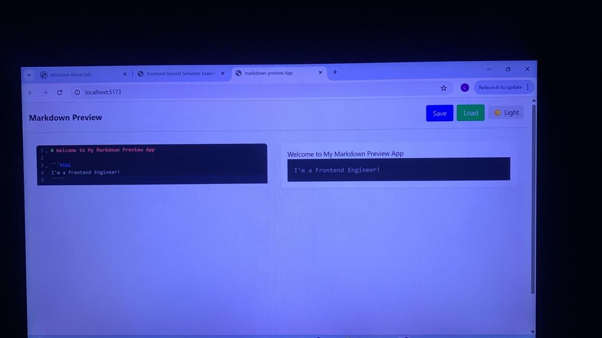
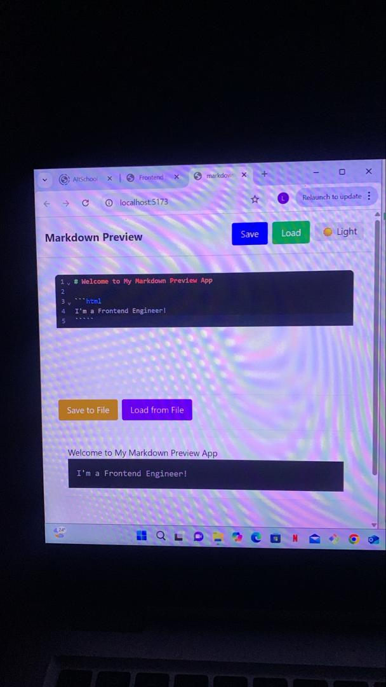
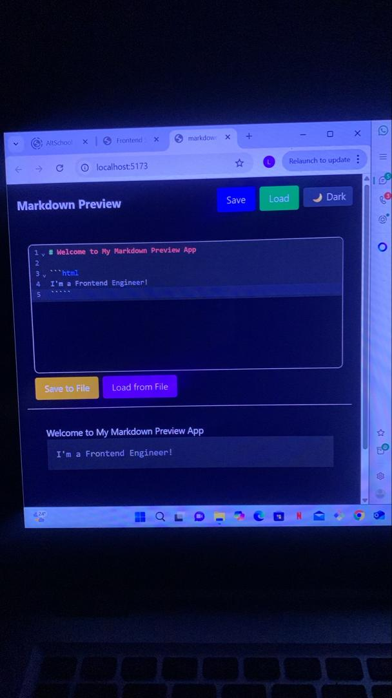
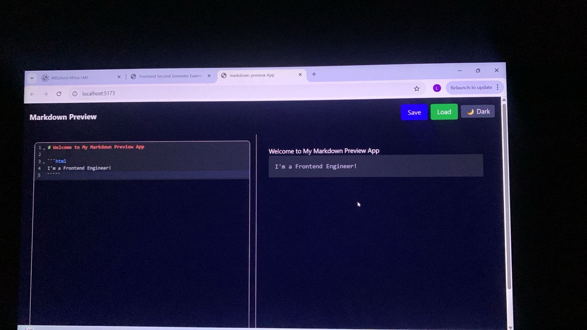

# Markdown Preview App

## Project Description
The **Markdown Preview App** is a React-based application that allows users to write Markdown text and see a live HTML preview in real-time.

It supports:  
- Side-by-side editor and preview on desktop, stacked layout for mobile.  
- Real-time rendering of Markdown elements including headings, lists, code blocks, links, images, and bold/italic text.  
- Syntax highlighting for code blocks.  
- Save/load Markdown content to local storage or download/upload `.md` files.  
- Integration with a remote API for demonstration.  
- Light/dark theme toggle.  
- Accessibility features including ARIA labels, keyboard navigation, and focus management.

This project demonstrates modern React patterns, React Query for API state management, Tailwind CSS for styling, and accessible UI/UX practices.

## Features
- **Markdown Editor:** Type or paste Markdown with live preview.  
- **Preview Panel:** Displays HTML output with syntax highlighting.  
- **Local Storage Persistence:** Automatically saves content as you type.  
- **File Operations:** Save to `.md` file, load from local `.md` file.  
- **API Integration:** Save/load Markdown content from a remote API.  
- **Theme Toggle:** Switch between light and dark mode.  
- **Accessibility:** ARIA labels, screen reader support, and focus management.


## Installation and Setup

### Prerequisites
- Node.js v18+  
- npm installed  

### Steps
1. Clone the repository:  
   ```bash
   git clone https://github.com/latifaib/markdown-preview.git
   cd markdown-preview
2. Install dependencies:
    npm install
3. Run the development server:
    npm run dev
4. Open the app in your browser at http://localhost:5173

## Available Scripts
- npm run dev — Starts the development server.
- npm run build — Builds production-ready files.
- npm run preview — Preview production build locally.

## Technology Stack & Architecture
## Stack:
- React 19+ – Functional components and hooks.
- React Router v7 – Navigation and routing.
- React Query (Tanstack) – API fetching and state - management.
- React Markdown + rehype-highlight – Markdown parsing and syntax highlighting.
- Highlight.js – Code syntax highlighting.
- Tailwind CSS (CDN) – Styling.
- ARIA Attributes & Semantic HTML – Accessibility.
- JavaScript – Core scripting language.

## Architecture Decisions:
- Editor and preview are separate components (Editor.jsx and Preview.jsx) for modularity.
- React Query manages API state without using useEffect.
- Local storage ensures persistence across page reloads.
- File operations use Blob and FileReader APIs for download/upload.

## API Documentation
This app demonstrates API integration using JSONPlaceholder.
Base URL: https://jsonplaceholder.typicode.com/posts

Save Markdown:
- Method: POST /posts:
- Body: { "title": "Markdown Doc", body:"<markdown_content>" }
- Returns: JSON object with saved content

Load Markdown:
- Method: GET /posts/1
- Returns: JSON object with body containing markdown text Note: This API is for demonstration purposes only. Local storage is now the default load/save source.

## Screenshots

### Theme Toggle


### Save/Load Buttons in Header


### Save/Load to File Buttons


### Responsive Layout



## Known Issues / Limitations
- API only returns placeholder content in French by default.
- Live preview supports only languages enabled by rehype-highlight.
- Accessibility features are partially implemented (further testing with screen readers recommended).

## Future Improvements
- Full multi-language syntax highlighting in editor.
- Drag-and-drop support for .md files.
- Persist theme preference in local storage.
- Complete keyboard navigation and ARIA landmark support.
- User authentication for saving/loading multiple Markdown files via API.
- Undo/redo functionality in the editor.